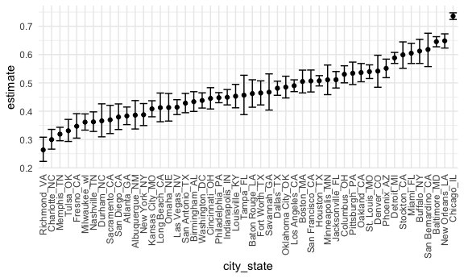
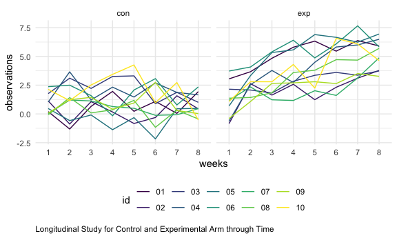
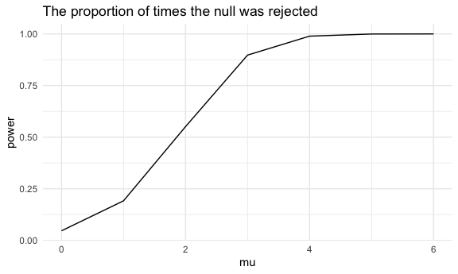
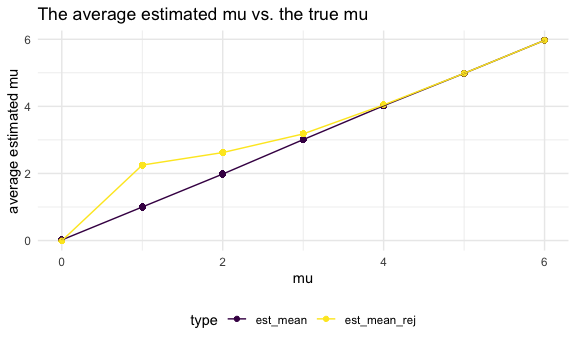

Homework 5
================
Yan Song

## Problem 1

Read in the data.

``` r
homicide_df = 
  read_csv("homicide_data/homicide-data.csv") %>% 
  mutate(
    city_state = str_c(city, state, sep = "_"),
    resolved = case_when(
      disposition == "Closed without arrest" ~ "unsolved",
      disposition == "Open/No arrest"        ~ "unsolved",
      disposition == "Closed by arrest"      ~ "solved",
    )
  ) %>% 
  select(city_state, resolved) %>% 
  filter(city_state != "Tulsa_AL")
```

    ## Parsed with column specification:
    ## cols(
    ##   uid = col_character(),
    ##   reported_date = col_double(),
    ##   victim_last = col_character(),
    ##   victim_first = col_character(),
    ##   victim_race = col_character(),
    ##   victim_age = col_character(),
    ##   victim_sex = col_character(),
    ##   city = col_character(),
    ##   state = col_character(),
    ##   lat = col_double(),
    ##   lon = col_double(),
    ##   disposition = col_character()
    ## )

Let’s look at this a bit

``` r
aggregate_df = 
  homicide_df %>% 
  group_by(city_state) %>% 
  summarize(
    hom_total = n(),
    hom_unsolved = sum(resolved == "unsolved")
  )
```

    ## `summarise()` ungrouping output (override with `.groups` argument)

Can I do a prop test for a single city?

``` r
prop.test(
  aggregate_df %>% filter(city_state == "Baltimore_MD") %>% pull(hom_unsolved), 
  aggregate_df %>% filter(city_state == "Baltimore_MD") %>% pull(hom_total)) %>% 
  broom::tidy()
```

    ## # A tibble: 1 x 8
    ##   estimate statistic  p.value parameter conf.low conf.high method    alternative
    ##      <dbl>     <dbl>    <dbl>     <int>    <dbl>     <dbl> <chr>     <chr>      
    ## 1    0.646      239. 6.46e-54         1    0.628     0.663 1-sample… two.sided

Try to iterate ……..

``` r
results_df = 
  aggregate_df %>% 
  mutate(
    prop_tests = map2(.x = hom_unsolved, .y = hom_total, ~prop.test(x = .x, n = .y)),
    tidy_tests = map(.x = prop_tests, ~broom::tidy(.x))
  ) %>% 
  select(-prop_tests) %>% 
  unnest(tidy_tests) %>% 
  select(city_state, estimate, conf.low, conf.high)
```

``` r
results_df %>% 
  mutate(city_state = fct_reorder(city_state, estimate)) %>% 
  ggplot(aes(x = city_state, y = estimate)) +
  geom_point() + 
  geom_errorbar(aes(ymin = conf.low, ymax = conf.high)) + 
  theme(axis.text.x = element_text(angle = 90, vjust = 0.5, hjust = 1))
```



``` r
city_prop_test = function(df) {
  
  n_unsovled 
  n_total 
  
  prop.test(.....)
  
}


homicide_df = 
  read_csv("homicide_data/homicide-data.csv") %>% 
  mutate(
    city_state = str_c(city, state, sep = "_"),
    resolved = case_when(
      disposition == "Closed without arrest" ~ "unsolved",
      disposition == "Open/No arrest"        ~ "unsolved",
      disposition == "Closed by arrest"      ~ "solved",
    )
  ) %>% 
  select(city_state, resolved) %>% 
  filter(city_state != "Tulsa_AL") %>% 
  nest(data = resolved)
```

    ## Parsed with column specification:
    ## cols(
    ##   uid = col_character(),
    ##   reported_date = col_double(),
    ##   victim_last = col_character(),
    ##   victim_first = col_character(),
    ##   victim_race = col_character(),
    ##   victim_age = col_character(),
    ##   victim_sex = col_character(),
    ##   city = col_character(),
    ##   state = col_character(),
    ##   lat = col_double(),
    ##   lon = col_double(),
    ##   disposition = col_character()
    ## )

# Problem 2

Start with a datafram containing all file names.

``` r
names_df = list.files('lda_data')
file_names_df = str_c("lda_data/",names_df)
```

Iterate over file names and read in data.\`

Building up the dataset for the further analyses.

``` r
 tidy_long_data = 
  long_data %>% 
  separate(name, into = c("group","id","csv")) %>% 
  select(-csv) %>% 
  select(id,group,everything()) %>% 
  pivot_longer(
    week_1:week_8,
    names_to = "week",
    names_prefix = "week_",
    values_to = "observational_value"
  ) 
```

Making the spaghetti plot.

``` r
tidy_long_data %>% 
  group_by(id,group) %>% 
  ggplot(aes(x = week, y = observational_value, group = id,color = id)) + 
  geom_line() + 
  labs(
    x = "weeks",
    y = "observations",
    caption = "Longitudinal Study for Control and Experimental Arm through Time") + 
  theme(plot.caption = element_text(hjust=0))+
  facet_grid(. ~ group)
```



  - The observation values is fluctuating during the 8 weeks. The
    figures indicates that the trend for control group tends to keep
    constant through 8 weeks while the experimental group showed an
    increasing trend during this period.

# Problem 3

Setting up the function

``` r
sim_mean = function(n = 30, mu = 0, sigma = 5) {
  
  sim_data = tibble(
    x = rnorm(n, mean = mu, sd = sigma),
  )
  
   sim_data %>% 
      t.test() %>% 
      broom::tidy() 
}
```

Testing the function

``` r
sim_results = rerun(5000, sim_mean(30, 0, 5)) %>% 
  bind_rows()
```

Simulating across multiple means

``` r
mu_list = 
  list(
    "mu_1" = 0,
    "mu_2" = 1, 
    "mu_3" = 2, 
    "mu_4" = 3, 
    "mu_5" = 4,
    "mu_6" = 5,
    "mu_7" = 6
    )
output = vector("list", length = 7)

for (i in 1:7) {
  output[[i]] = rerun(5000, sim_mean(mu = mu_list[[i]])) %>% 
    bind_rows
}
```

``` r
sim_results =
  tibble(
  mu = c(0, 1, 2, 3, 4, 5, 6)
) %>% 
  mutate(
    output_lists = map(.x = mu, ~ rerun(5000, sim_mean(mu = .x))),
    estimate_dfs = map(output_lists, bind_rows)
  ) %>% 
  select(-output_lists) %>% 
  unnest(estimate_dfs) %>% 
  select(mu,estimate, p.value)
```

Make a plot showing the proportion of times the null was rejected.

``` r
test_df = 
  sim_results %>% 
  mutate(
    test_results = case_when(p.value < 0.05 ~ "rejected",
                            p.value >= 0.05 ~ "failed to reject")
  ) %>% 
  select(mu, test_results) %>% 
  group_by(mu) %>%
  summarize(
    reject_num = sum(test_results == "rejected")
  ) %>% 
  mutate(power = reject_num / 5000)
```

    ## `summarise()` ungrouping output (override with `.groups` argument)

``` r
test_df %>% 
  ggplot(aes(x = mu, y = power)) +
  geom_line()+
  labs(
    title = "The proportion of times the null was rejected")
```



  - The figure showed that the power will increase with the effect size
    increasing, given that alpha and sample size keep constant.

-----

Make two plots.

``` r
df=sim_results %>% 
  mutate(
    test_results = case_when(p.value < 0.05 ~ "reject",
                            p.value >= 0.05 ~ "fail to reject")
         ) %>%
  group_by(mu) %>% 
  mutate(est_mean = mean(estimate)) %>% 
  ungroup() %>% 
  group_by(mu, test_results) %>% 
  filter(test_results == "reject") %>% 
  mutate(est_mean_rej = mean(estimate)) %>% 
  pivot_longer(
    cols = c(est_mean, est_mean_rej),
    names_to = "type",
    values_to = "est_mean_mu"
  )

df%>% 
  ggplot(aes(x = mu, y = est_mean_mu, color = type)) + 
  geom_point() + 
  geom_path()+
  labs(title = "The average estimated mu vs. the true mu",
       y= "average estimated mu")
```



  - According to the plot, it is found that the sample average of
    estimated mu across test for which the null is rejected is different
    from the true mu. As the effect size increases, the sample average
    estimated mu across test for which the null is rejected is closer or
    approximately equals to the true value of mu. For the test in which
    the null is rejected, the random error is larger. In other words, if
    only estimated mu for these samples are calculated, larger random
    error will be generated and the estimated mean will be more away
    from the true mu.
